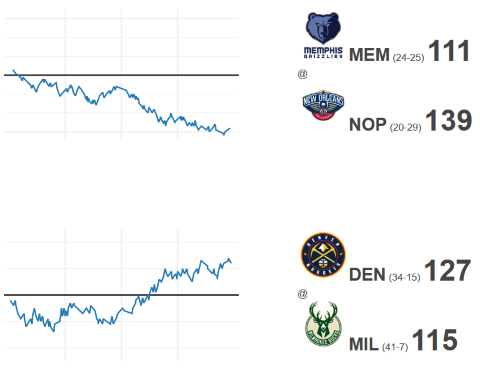

# NBA Sparklines

A very quick, local implementation of Edward Tufte's sparklines using the plotly graphing libraries.

https://plot.ly/javascript/

Data being used is from 1/31/20:

https://stats.nba.com/scores/01/31/2020

Inspired by a fantastic post by Panos Papiotis:

https://towardsdatascience.com/pretending-to-know-about-the-nba-using-python-699177a58685

